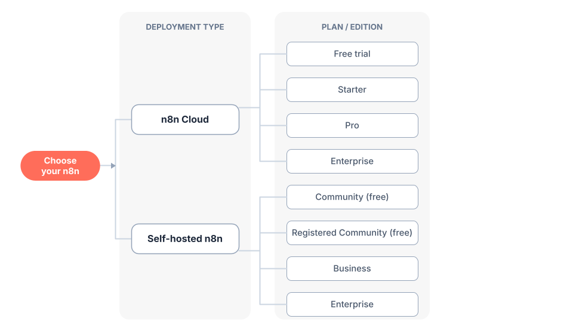

# 02 · 选择使用方式与安装

> **Choose How to Use n8n & Install**
>
> 官方出处：`docs/get-started/choose-how-to-use-n8n.md`、`docs/deploy/host-n8n/install-options/install-with-docker.md`、`install-with-npm.md`

---

## 本节目标 / What You'll Learn

- 云端（n8n Cloud）和自部署（Self-hosted）怎么选
- 中国本土化的选择建议（网络、成本、镜像）
- 三种开始方式：注册云账号 / Docker 安装 / npm 安装
- 验证 n8n 是否启动成功

---

## 1. 两种主要使用方式 / Two Main Options

官方手册给出两个主要部署选项：

> **官方原文**：n8n offers two primary deployment options: **n8n Cloud** (fully-managed) and **Self-hosted** (deploy on your own infrastructure).
>
> **翻译**：n8n 提供两种主要部署选项：**n8n Cloud**（全托管）和**自部署**（部署在你自己的基础设施上）。

| 对比项 | ☁️ n8n Cloud（云端） | 🖥️ 自部署 Self-hosted |
|--------|---------------------|----------------------|
| 安装 | 无需安装，注册即用 | 需要自己装（Docker / npm / 服务器） |
| 技术门槛 | 零门槛 | 需要一些命令行基础 |
| 维护 | n8n 官方维护 | 自己维护 |
| 数据 | 存在官方服务器 | 存在你自己的机器上 |
| 费用 | 免费试用 14 天（Pro 功能），之后付费 | 社区版**免费**（几乎全部功能） |
| 国内访问 | ⚠️ 可能需要科学上网 | ✅ 完全可控 |



*（上图来自官方手册 choose-how-to-use-n8n.md）*

### 官方选择建议（翻译整理）

| 你的情况 | 推荐 | 原因 |
|---------|------|------|
| 想快速开始 | ☁️ Cloud | 无需安装 |
| 没有技术基础 | ☁️ Cloud | 全托管，不用折腾 |
| 不想花钱 | 🖥️ 自部署社区版 | 免费且几乎包含全部功能 |
| 需要完全掌控 | 🖥️ 自部署 | 自己掌控环境和配置 |
| 生产环境正式使用 | 两者皆可 | 云和自部署都支持生产 |
| 需要企业功能（SSO、环境、项目） | 两者皆可 | 都需要付费计划 |

---

## 2. 本土化建议（中国用户必读）/ Localization Advice

基于上面的官方对比，针对国内环境，本教程给出以下建议：

| 你的身份 | 建议方案 | 原因 |
|---------|---------|------|
| 纯新手、想先体验 | ☁️ **n8n Cloud 免费试用**（配合科学上网） | 最快上手，0 安装 |
| 想长期免费使用 | 🖥️ **自部署（Docker 或 npm）** | 免费、数据在自己手里、国内访问无压力 |
| 有服务器/云主机 | 🖥️ 自部署 | 可控性最强 |
| 只做本地学习测试 | 🖥️ 自部署（本机 Docker/npm） | 免费、不占服务器 |

> ⚠️ **网络提示**：n8n Cloud（app.n8n.cloud）以及其注册页在国内访问可能不稳定或需要特殊网络环境。如果 Cloud 打不开，**直接选择自部署**，教程第 3.2 节给了详细命令。

---

## 3. 开始使用 / Getting Started

### 3.1 方式 A：n8n Cloud（推荐纯新手体验）

> **官方原文**：This quickstart uses [n8n Cloud](https://app.gitbook.com/s/jm0ZYRpZIPWge2ZSiDYO/use-n8n-cloud), which is recommended for new users. A free trial is available.
>
> **翻译**：本快速上手使用 n8n Cloud，这是推荐给新用户的方式。提供免费试用。

**步骤**：

1. 打开注册页：<https://app.n8n.cloud/register>
2. 用邮箱注册，收到验证邮件后点击验证链接
3. 登录后即可开始使用（免费试用 14 天 Pro 功能）

> 💡 **小白提示**：Cloud 版界面和自部署版完全一样，学的东西都能用上。试用结束后不付费并不会影响你学习——但如果你没有国外支付方式，建议用方式 B 自部署长期使用。

### 3.2 方式 B：自部署——Docker 安装（推荐，含国内镜像加速）

> **官方原文（安装前提）**：n8n recommends using Docker for most self-hosting needs. It provides a clean, isolated environment.
>
> **翻译**：n8n 推荐大多数自部署场景使用 Docker，它能提供干净、隔离的环境。

**第一步：安装 Docker Desktop**

- 官网下载：<https://www.docker.com/products/docker-desktop/>
- 国内用户：如果官网下载慢，可在国内镜像站（如阿里云、腾讯云容器镜像服务）下载 Docker Desktop，或从国内软件源安装。
- 安装后启动 Docker Desktop（Windows/Mac 上通常是一个桌面应用；Linux 用 `sudo systemctl start docker`）。

**第二步：创建数据卷并启动 n8n**

打开终端（Windows 用 PowerShell 或 CMD，Mac/Linux 用 Terminal），执行：

```bash
# 1. 创建数据卷（保存 n8n 数据，容器删了数据还在）
docker volume create n8n_data

# 2. 启动 n8n（Windows PowerShell 用反引号 ` 换行，或直接一行输入）
docker run -it --rm --name n8n \
  -p 5678:5678 \
  -e GENERIC_TIMEZONE="Asia/Shanghai" \
  -e TZ="Asia/Shanghai" \
  -v n8n_data:/home/node/.n8n \
  docker.n8n.io/n8nio/n8n
```

如果不想换行（小白建议直接复制这一行）：

```bash
docker run -it --rm --name n8n -p 5678:5678 -e GENERIC_TIMEZONE="Asia/Shanghai" -e TZ="Asia/Shanghai" -v n8n_data:/home/node/.n8n docker.n8n.io/n8nio/n8n
```

> 🌏 **国内镜像加速**：如果拉取 `docker.n8n.io/n8nio/n8n` 镜像很慢，可以：
> 1. 在 Docker Desktop → Settings → Docker Engine 中添加国内镜像加速器（如 `https://docker.m.daocloud.io` 等）；
> 2. 或先 `docker pull docker.n8n.io/n8nio/n8n` 耐心等待一次，之后就会缓存到本地。
>
> ⏰ **时区说明**：`GENERIC_TIMEZONE` / `TZ` 设为 `Asia/Shanghai`，这样「定时触发器」会按北京时间运行（官方手册建议设置正确时区）。

**第三步：验证启动**

1. 打开浏览器访问 <http://localhost:5678>
2. 首次打开会让你设置一个管理员账号（邮箱 + 密码），设置完成即可进入编辑界面
3. 看到 n8n 的编辑界面（有 Canvas 画布）就成功了！🎉

> 💡 **小白提示**：看到 `[报错] Unable to reach n8n` 之类提示？先确认终端里 n8n 还在运行（窗口没关），再确认浏览器地址是 `http://localhost:5678`。

### 3.3 方式 C：自部署——npm 安装（不需要 Docker 时）

如果你已经有 Node.js 环境（官方要求 Node.js 18 及以上）：

```bash
# 1. 用 npx 快速体验（不全局安装，下载即用）
npx n8n

# 或者全局安装
npm install n8n -g
n8n start
```

同样打开 <http://localhost:5678> 使用。

> **官方原文**：This command will download everything that's needed to start n8n. You can then access n8n and start building workflows by opening http://localhost:5678.
>
> **翻译**：该命令会下载启动 n8n 所需的全部内容，然后打开 http://localhost:5678 即可开始构建工作流。

---

## 4. 三种方式怎么选？一张图看懂 / Decision Flow

```
你想怎么用 n8n？
│
├─ 只想快速试试看 → ☁️ Cloud 免费试用（14 天，需特殊网络）
│
├─ 想长期免费使用
│   ├─ 有 Docker 经验/愿意装 → 🖥️ Docker 自部署（推荐 ⭐）
│   └─ 有 Node.js 环境 → 🖥️ npm 自部署
│
└─ 团队/企业正式用 → 付费计划（Cloud 或自部署皆可）
```

> 💡 本教程后续所有章节都以**自部署版界面**为例，Cloud 版界面完全一致，可放心跟随。

---

## 5. 更多部署方式一览 / More Deployment Options

官方手册 `docs/deploy/host-n8n/install-options/` 还提供了以下方式（第 15 章会展开讲）：

| 方式 | 适合场景 | 官方文档 |
|------|---------|---------|
| **Docker Compose** | 生产环境、需要数据库/多容器编排 | `install-options/use-a-cloud-provider/use-docker-compose.md` |
| **npm** | 本地开发、单服务器部署 | `install-options/install-with-npm.md` |
| **AI Starter Kit** | 想快速搭一套 AI 应用环境（含 Postgres、Qdrant、n8n 等） | `deploy-with-the-ai-starter-kit.md` |
| AWS / Azure / GCP | 云服务器上部署 | `install-options/use-a-cloud-provider/*` |
| DigitalOcean / Hetzner / Heroku 等 | 各家云平台一键部署 | 同上 |

> 💡 **AI Starter Kit 是什么？** 官方提供的一键启动包，用 Docker Compose 把 **n8n + PostgreSQL + Qdrant（向量数据库）** 打包好，做 AI 工作流（第 12 章）时能省掉自己配数据库的功夫。

## 6. 安装之后：别忘了升级 / Keep It Updated

n8n 迭代很快（版本号已经到 2.x），自部署的用户要**定期升级**。简单说：

```bash
# Docker 方式：拉新镜像 → 重建容器（数据在数据卷里，不会丢）
docker pull docker.n8n.io/n8nio/n8n
docker stop <容器ID>
docker rm <容器ID>
docker run --name=n8n [之前的参数] -d docker.n8n.io/n8nio/n8n
```

> ⚠️ **升级前**：先看一眼[官方更新日志](https://docs.n8n.io/changelog/)里的大版本迁移指南（v1→v2 等），个别大版本有破坏性变更。第 15 章有完整的升级与运维说明。

---

**下一章 →** [03 · 创建你的第一个工作流](03-创建第一个工作流.md)
