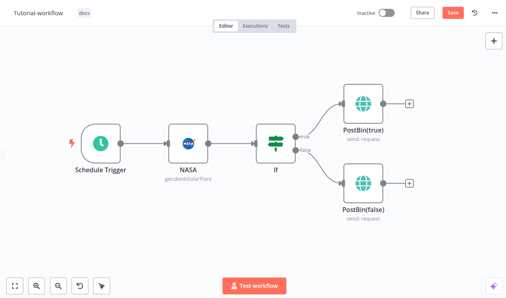
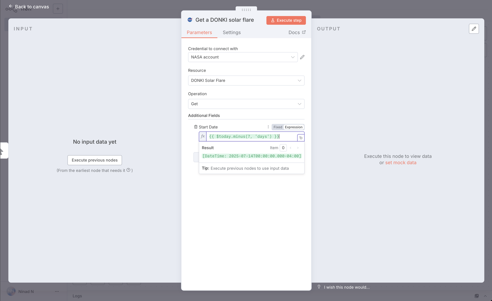
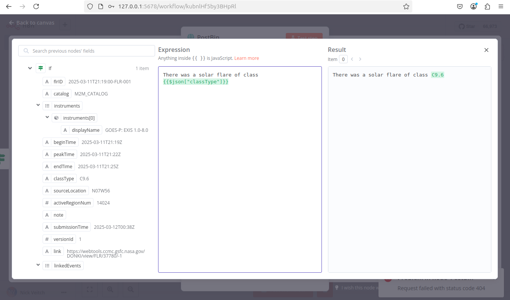

# 03 · 创建你的第一个工作流

> **Build Your First Workflow**
>
> 官方出处：`docs/get-started/build-your-first-workflow.md`（官方新手教程，本教程为其中英对照友好版）
>
> 官方教程原文地址：<https://docs.n8n.io/get-started/build-your-first-workflow>

---

## 本节目标 / What You'll Learn

**中文版目标**：亲手从零搭一个能用的自动化工作流——「每周抓取 NASA 太阳耀斑数据，按级别分类后发送报告」。

在这个过程中你会学到（与官方教程一致）：

- 用触发器节点（Trigger Node）启动工作流
- 配置凭据（Credentials）
- 处理数据（Processing Data）
- 在工作流里表示逻辑（If 条件判断）
- 使用表达式（Expressions）

> 💡 **小白提示**：本教程用到的是「真实的外部服务」——NASA 的公开 API。每一步都会解释「为什么这么做」，跟着点就好，遇到任何报错先看第 06 章的排查表。

---

## 完成后工作流长这样 / The Finished Workflow

```
    ┌──────────────┐     ┌──────────┐     ┌────────┐      ┌───────────────────┐
    │ Schedule     │────▶│ NASA     │────▶│ If     │──真─▶│ PostBin (true)    │
    │ Trigger 定时  │     │ 抓太阳耀斑 │     │ 条件判断 │──假─▶│ PostBin (false)   │
    └──────────────┘     └──────────┘     └────────┘      └───────────────────┘
        定时启动            请求数据          分类 X 级        发送两路报告
```



> 官方原文：This guide will show you how to construct a workflow in n8n, explaining key concepts along the way.
> 翻译：本指南将带你构建一个 n8n 工作流，并沿途讲解关键概念。

---

## 开始之前 / Before You Start

官方推荐新用户使用 n8n Cloud（第 02 章方式 A）。如果你用的是自部署版（方式 B/C），操作界面**完全一样**，直接跟着做即可。

你还需要准备两个外部账号（都是免费的）：

| 服务 | 用途 | 官网 |
|------|------|------|
| NASA API Key | 获取太阳耀斑数据 | <https://api.nasa.gov/> |
| Postbin | 接收并展示发送的数据（临时网页） | <https://www.toptal.com/developers/postbin/> |

> 🌏 **本土化替代方案**：如果 NASA 官网或 Postbin 在国内无法访问，第 7 节给出完全等价的替代练习方案，**先读完 2~6 节再回来换**。

---

## Step 1 · 新建工作流 / Create a New Workflow

打开 n8n 后，你会看到两种情况之一：

- **情况 A**：一个欢迎窗口，有两个大按钮 → 点击 **Start from Scratch**（从零开始）创建新工作流。
- **情况 B**：Overview（概览）页面的 **Workflows**（工作流）列表 → 点击 **Create Workflow**（创建工作流）。

> 💡 小白提示：Create Workflow / Start from Scratch 都是「新建一个空白工作流」，选哪个都行。

---

## Step 2 · 添加触发器节点 / Add a Trigger Node

n8n 提供两种启动工作流的方式：

| 方式 | 说明 |
|------|------|
| **手动执行** | 点击 **Execute Workflow**（执行工作流）按钮 |
| **触发器自动执行** | 第一个节点是触发器（Trigger），工作流会在收到外部事件或到达设定时间时自动运行 |

本教程使用 **Schedule Trigger（定时触发器）**，让工作流按计划自动运行。

**操作步骤**：

1. 点击 **Add first step**（添加第一步）。
2. 在搜索框输入 **Schedule**，n8n 会显示匹配的节点列表。
3. 选择 **Schedule Trigger**，节点会添加到画布上并自动打开设置面板。
4. **Trigger Interval**（触发间隔）选择 **Weeks**（周）。
5. **Weeks Between Triggers**（每几周触发一次）输入 `1`。
6. 设置具体时间：**Trigger on Weekdays**（每周几）勾选 **Monday**（周一），**Trigger at Hour**（几点）选 **9am**（上午 9 点），**Trigger at Minute**（几分）填 `0`。
7. 关闭节点设置面板，回到画布。

> 官方原文：The trigger node runs the workflow in response to an external event, or based on your settings.
> 翻译：触发器节点响应外部事件，或根据你的设置来运行工作流。
>
> ⏰ **本土化提示**：自部署时如果设置过 `Asia/Shanghai` 时区（第 02 章），这里的 9am 就是北京时间上午 9 点。若没设置时区，默认是服务器时间。

---

## Step 3 · 添加 NASA 节点并配置凭据 / Add the NASA Node & Set Up Credentials

**NASA 节点** 的作用是调用 NASA 的公开 API（应用程序接口）获取真实数据。我们用它的实时数据来查找太阳活动。

**首先，理解凭据（Credentials）**：

> 官方原文：Credentials are private pieces of information issued by apps and services to authenticate you as a user and allow you to connect and share information between the app or service and the n8n node.
> 翻译：凭据是应用和服务颁发给你的私密信息，用于验证你的身份，并允许你在该服务与 n8n 节点之间连接和共享信息。

**操作步骤**：

1. 点击 **Schedule Trigger** 节点上的 **Add node**（添加节点）连接点（画布上节点右侧的小圆点）。
2. 搜索 **NASA**，在结果中选择 **NASA** 节点。
3. 选择操作（Operation）：搜索并选择 **Get a DONKI solar flare**（获取 DONKI 太阳耀斑）。这个操作返回近期太阳耀斑的报告。选择后 n8n 会把节点加到画布并打开它。
4. **配置凭据**（要访问 NASA API，必须设置）：
   1. 点击 **Credential for NASA API**（NASA API 凭据）下拉框。
   2. 选择 **Create new credential**（创建新凭据），n8n 会打开凭据编辑视图。
   3. 打开 <https://api.nasa.gov/>，点击 **Generate API Key**（生成 API 密钥）链接并填写表单。NASA 会生成密钥并发送到你填写的邮箱。
   4. 去邮箱查收 API 密钥（没看到就检查垃圾邮件/订阅邮件文件夹），复制后粘贴到 n8n 的 **API Key** 输入框。
   5. 点击 **Save**（保存）。
   6. 关闭凭据界面，返回节点设置。新的凭据应该已自动选中。
5. **设置时间范围**：DONKI Solar Flare 默认返回过去 30 天的数据。要只取最近一周：
   1. 展开 **Additional Fields**（附加字段），点击 **Add field**（添加字段）。
   2. 选择 **Start date**（开始日期）。
   3. 在 **Start date** 旁切换到 **Expression**（表达式）选项卡，点击展开按钮打开完整的表达式编辑器。
   4. 在表达式框输入：

   ```js
   {{ $today.minus(7, 'days') }}
   ```

   > 官方原文：This generates a date in the correct format, seven days before the current date.
   > 翻译：这会生成一个格式正确的日期——当前日期往前 7 天。
   >
   > 💡 **小白提示**：`$today` 是 n8n 内置变量，代表今天；`.minus(7, 'days')` 是「减 7 天」。现在不用懂语法，第 04 章会详细讲表达式。

   

6. 关闭表达式编辑器，返回 NASA 节点。
7. **测试节点**：点击 **Execute step**（执行本步骤）手动运行该节点。n8n 会调用 NASA API，并在 **OUTPUT**（输出）面板显示过去 7 天的太阳耀斑信息。
8. 关闭 NASA 节点，回到画布。

> ✅ **为什么这一步很重要**：这一步你学会了「配置凭据」和「测试单节点」——这是后续所有节点操作的通用技能。

---

## Step 4 · 用 If 节点添加逻辑 / Add Logic with the If Node

n8n 支持在工作流中表达复杂逻辑。这里用 **If（如果）节点** 创建两个分支，分别生成不同级别的报告。

太阳耀斑有 5 种分级（A、B、C、M、X，X 最强）。我们加一段逻辑：**X 级**的走一个分支，其他级别的走另一个分支。

**操作步骤**：

1. 点击 **NASA** 节点上的 **Add node** 连接点。
2. 搜索 **If**，选择 **If** 节点，节点会添加到画布并打开。
3. 设置判断条件——检查 NASA 数据里的 `classType`（级别）字段：
   1. **把 `classType` 拖拽到 Value 1（值 1）**。这一步就是「数据映射（Data Mapping）」，拖过去后会自动生成表达式。
      > ⚠️ 官方提示：如果上一步没执行 NASA 节点，这一步会看不到任何数据可拖。先回去执行 NASA 节点！
   2. 把比较操作改为 **String > Contains**（字符串 > 包含）。
   3. 在 **Value 2** 输入 **X**（太阳耀斑的最高级别）。下一步会创建两个报告：X 级的一份，其他级别的一份。
4. **测试节点**：点击 **Execute step**。n8n 会把数据按条件测试，并在 OUTPUT 面板显示哪些数据匹配（true 真）哪些不匹配（false 假）。
   > 💡 官方提示：如果运行的时候正好没有 X 级耀斑，把 Value 2 里的 **X** 换成 **A**、**B**、**C** 或 **M** 即可。
5. 确认节点能返回结果后，关闭节点回到画布。

```
（If 节点逻辑示意）
    classType 包含 "X" ?
        │
   ┌────┴────┐
  真         假
 (true)    (false)
   │          │
  PostBin   PostBin
  (X级报告)  (其他级别报告)
```

---

## Step 5 · 输出工作流数据 / Output Data from Your Workflow

工作流的最后一步是把两份报告发送出去。这里使用 **Postbin**——一个接收数据并在临时网页上展示的服务。

**操作步骤**：

1. 在 **If** 节点上，点击标着 **true**（真）的 **Add node** 连接点。
2. 搜索 **PostBin**，选择它。
3. 选择 **Send a request**（发送请求），节点添加到画布并打开。
4. 打开 <https://www.toptal.com/developers/postbin/>，点击 **Create Bin**（创建收件箱）。**保持这个标签页开着**，后面测试要回来刷新看结果。
5. 复制 **bin ID**（收件箱 ID），长这样：`1651063625300-2016451240051`。
6. 回到 n8n，把 ID 粘贴到 **Bin ID** 输入框。
7. 配置要发送的内容：鼠标悬停在 **Bin Content**（内容）上，切换到 **Expression**（表达式）选项卡，点击展开按钮打开完整表达式编辑器。
8. **拖拽数据字段**：从 If 节点的输出面板里，把 `classType` 字段拖进表达式编辑器，它会自动生成引用 `{{$json["classType"]}}`。
9. 在引用前后加上文字，让完整表达式变成：

   ```js
   There was a solar flare of class {{$json["classType"]}}
   ```

   > 官方原文：There was a solar flare of class …（翻译：出现了一次 XX 级的太阳耀斑）
   > 💡 小白提示：`{{$json["classType"]}}` 的意思是「把当前数据的 classType 字段的值填在这里」。运行时会自动替换成真实的级别，比如 "There was a solar flare of class X1.2"。

   

10. 关闭表达式编辑器，返回节点。
11. 关闭 Postbin 节点，回到画布。
12. **再添加一个 Postbin 节点**，处理 If 节点的 **false**（假）输出路径：
    1. 鼠标悬停在第一个 Postbin 节点上，点击菜单（节点右上角的 **⋯** 图标，官方叫 Node context menu）→ 选择 **Duplicate node**（复制节点）。
    2. 把 **If** 节点的 **false** 连接点拖到新 Postbin 节点的左侧。

---

## Step 6 · 测试整个工作流 / Test the Workflow

1. 点击 **Execute Workflow**（执行工作流）。n8n 会依次运行所有节点，你可以在画布上看到每个阶段的执行状态。
2. 回到 Postbin 页面，**刷新**，就能看到发送过来的报告内容了！
3. 如果你希望这个工作流**每周自动运行**（而不是每次手动点），点击 **Publish**（发布）。

> ⚠️ **官方提示（时间限制）**：Postbin 的收件箱创建后只存在 **30 分钟**。如果超时了，需要重新 Create Bin 并把新 ID 填到 Postbin 节点里。

---

## 🎉 恭喜！/ Congratulations

你现在拥有一个能真正干活的自动化工作流了！它看起来应该像本教程开头的示意图。

> 官方原文：You now have a fully functioning workflow that does something useful!
> 翻译：你现在拥有一个完整可用、真正有用的工作流了！

**这一路你学会了：**

- 找到想要的节点并把它们连接起来
- 用表达式处理数据
- 创建凭据并挂到节点上
- 在工作流中使用逻辑

**想直接导入官方成品？** 官方手册仓库里自带这个工作流的 JSON 文件（含全部节点配置），你可以直接导入到你的 n8n（画布右上角 **⋮ 菜单 → Import from File / Import from URL**，选择/填写该 JSON）：

- 本地路径：`docs/_workflows/try-it-out/quickstart/tutorial.json`
- 在线地址：<https://raw.githubusercontent.com/n8n-io/n8n-docs/refs/heads/main/docs/_workflows/try-it-out/quickstart/tutorial.json>

> ⚠️ 导入后仍需自己配置 NASA 凭据和 Postbin ID（模板里的凭据是示例，导入后不会生效）。

---

## 7. 本土化替代练习（网络受限时）/ Alternative Practice Setup

如果 NASA 或 Postbin 在你网络环境下打不开，用下面的等价方案练习**同样的技能**（定时触发、获取数据、条件判断、发送结果），一套流程不白学：

| 原节点 | 替代方案 | 说明 |
|--------|---------|------|
| NASA 节点 | **HTTP Request 节点** | 请求 <https://httpbin.org/json> 或 <https://api.quotable.io/random> 等国内可访问的免费 API，无需凭据 |
| Postbin 节点 | **Webhook.site 或 RequestBin** | 国内一般可访问 <https://webhook.site>；或直接改用 **Gmail/Telegram 通知节点**发送结果（更实用） |

**练习思路**：定时触发 → HTTP Request 抓取一条随机语录/JSON → If 判断某个字段（比如语录长度是否大于 50 字）→ 真分支发通知 A，假分支发通知 B。

> 💡 **为什么这样做**：技能是一样的——「取数、判断、输出」。以后接任何真实服务（企业微信、钉钉、数据库、AI 接口）都是这套流程。

---

## 8. 关于发布与版本（重要）/ Publish & Versions

官方教程最后让你点 **Publish（发布）**——n8n 的保存/发布机制值得花 30 秒理解：

- **自动保存**：编辑时 n8n 自动保存（通常 1~5 秒内），**没有手动保存按钮**。
- **草稿与发布**：所有改动先留在「草稿」里；只有点 **Publish** 后，**定时器才会按计划跑、Webhook 才会用生产地址**。
- **版本历史**：每次发布都会留下一个版本，随时可以回滚（第 06 章详细讲）。

> 官方原文：n8n auto saves your workflow while you're editing. When you're ready to put the workflow into production, publish your workflow.
> 翻译：编辑时 n8n 自动保存。当你准备好把工作流投入生产时，发布它。

> 💡 **小白提示**：学习阶段不发布也能手动测试（Execute Workflow 按钮）。发布主要是为了「定时自动跑」和「Webhook 生效」。

---

**下一章 →** [04 · 数据与表达式](04-数据与表达式.md)
