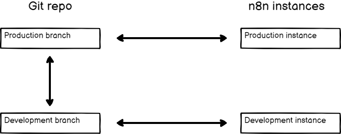
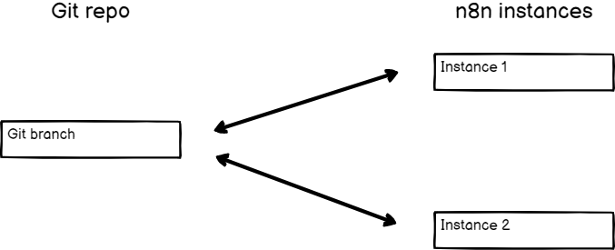
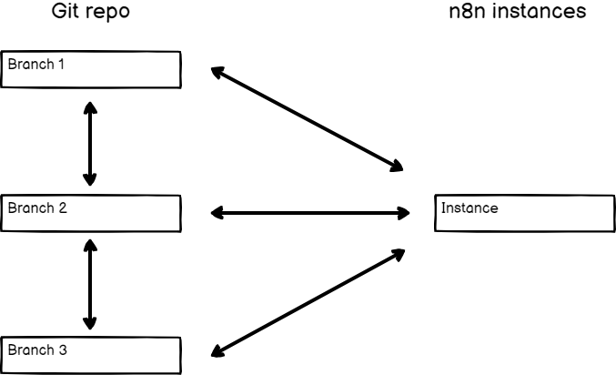

# 分支模式 (Branch patterns)

n8n 实例与 Git 分支之间的关系非常灵活。你可以根据自己的需要，搭建不同的组合方式。




**小白解释：什么是"分支模式"？**

"分支模式"就是回答一个问题：**你有几个 n8n 实例？你的 Git 仓库里有几个分支？** 不同的"实例数量 × 分支数量"组合，就是不同的分支模式。下面 4 种模式分别适合不同的使用场景。


## 多个实例、多个分支 (Multiple instances, multiple branches)

这种模式是：你有多个 n8n 实例，每个实例各自连接一个属于自己的分支。

你可以用这种模式来做环境隔离（environments）。例如，创建两个 n8n 实例：开发（development）和生产（production）。把它们分别连接到各自的分支。在开发实例里把工作推送到它的分支，然后在 Git 仓库里发起一个 Pull Request（拉取请求），把工作合并到生产分支，最后在生产实例里拉取（pull）下来。




**适合场景**

这是最"规范"的环境隔离方式：开发和生产完全分开，工作要经过 Git 的 Pull Request 审核流程才能进入生产。适合正式团队和重要系统。缺点是维护成本最高（要管理多套实例）。


## 多个实例、一个分支 (Multiple instances, one branch)

如果你希望所有地方使用完全相同的工作流、标签（tags）和变量，但在不同的 n8n 实例中使用它们，就用这种模式。

你可以用这种模式来做环境。例如，创建两个 n8n 实例：开发和生产的实例，把它们都连接到同一个分支。在开发实例里推送（push）工作，然后到生产实例里拉取（pull）下来。

这种模式在测试 n8n 新版本时也很有用：你可以用新版本创建一个新的 n8n 实例，把它连接到同一个 Git 分支上测试；在此期间，你的生产实例继续使用旧版本，直到你确认升级安全后再切换。




**适合场景**

两个实例共享同一份"工作"，省去了合并分支的麻烦。适合"开发完直接推到生产"的简单流程。缺点是开发和生产没有审核闸门，改动会直接进入生产。


## 一个实例、多个分支 (One instance, multiple branches)

实例所有者（owner）可以切换连接到这个实例的 Git 分支。这种场景的完整方案，通常就是前面说的[多个实例、多个分支](#multiple-instances-multiple-branches)模式，只不过是用一个实例在不同分支之间切换。

这种模式适合用来**审查工作**（review）。例如：不同的用户可以在各自的实例上工作，并推送到各自的分支；审查者可以在一个"审查实例"里工作，通过切换分支来加载不同用户提交的工作。


**注意：切换分支不会清理内容**

n8n 在切换分支时，不会清理实例里已有的内容。在这种模式下切换分支，会导致每个分支的所有工作流都堆积在你的实例里。



**小白解释：为什么要注意？**

假设分支 A 里有 3 个工作流，分支 B 里有 2 个工作流。你把实例从 A 切到 B，实例里不是"只有 B 的 2 个"，而是 A 的 3 个 + B 的 2 个全都在。所以这种模式只适合临时查看，不适合做环境隔离。


## 一个实例、一个分支 (One instance, one branch)

这是最简单的模式。


**适合场景**

只有一个 n8n 实例、只用一个分支。通常用于个人项目或非常简单的部署：只需要一份"Git 里的备份/版本记录"，不需要多环境。

