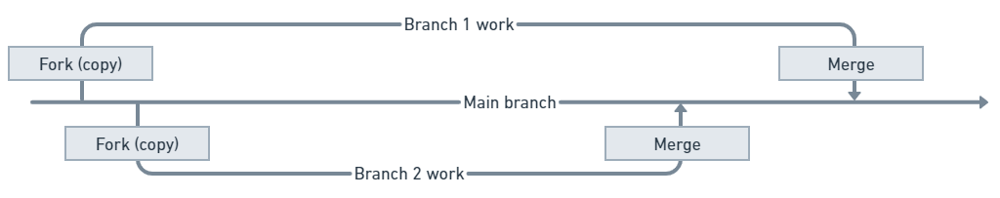

# Git 与 n8n (Git and n8n)

n8n 使用 Git 来提供源码控制（source control）。要用好这个功能，最好对 Git 的基础概念有一些了解。注意：n8n **没有实现** Git 的全部功能——你不应该把 n8n 的源码控制当成完整的版本控制（version control）系统来用。


**刚接触 Git 和源码控制？**

如果你是 Git 新手，别慌。你不需要为了使用 n8n 去专门学 Git。本文会解释你需要掌握的概念。不过，**设置源码控制**这一步确实需要一些 Git 知识，因为那一步要在你的 Git 服务商里操作。



**已经熟悉 Git 和源码控制？**

如果你熟悉 Git，请注意：n8n 的行为并不保证和标准 Git 完全一致。特别要留意：n8n 的源码控制**不支持**"拉取请求（Pull Request）式的审查与合并流程"，除非你在 n8n 之外、在你的 Git 服务商里自己做这件事。


本页介绍 n8n 中用到的 Git 概念和术语。它不会覆盖设置和管理仓库所需的全部知识。负责[设置 (Setup)](set-up-source-control.md)的人应该对 Git 和他们的 Git 托管服务商有一定了解。


**这只是个简短的入门**

Git 是一个复杂的主题。本节只简要介绍你在 n8n 中使用环境功能时需要的关键术语。如果你想深入学习 Git，请参考 [GitHub | Git 和 GitHub 学习资源 (Git and GitHub learning resources)](https://docs.github.com/en/get-started/quickstart/git-and-github-learning-resources)。


## Git 概览 (Git overview)

[Git](https://git-scm.com/) 是一个用于管理、跟踪和协作处理多个文档版本的工具。它是 [GitHub](https://github.com/) 和 [GitLab](https://about.gitlab.com/) 等广泛使用的平台的基础。


**小白解释：一句话理解 Git**

Git 就像 Word 文档的"历史版本 + 多人协作"功能：它能记住每次修改，能并存多个不同的版本，还能让多个人各改各的、最后合并到一起。程序员用它管代码，n8n 借用它来管你的工作流。


## 分支：一个项目的多个副本 (Branches: Multiple copies of a project)

Git 用分支（branches）来同时维护一个文档的多个副本。每个分支都有自己的版本。一个常见的模式是：有一个 main（主）分支，然后每个想给项目做贡献的人在自己的分支（副本）上工作；工作完成后，把他们的分支合并回 main 分支。


**小白解释：分支怎么理解？**

把项目想象成一棵树的主干，分支就是树干上长出来的不同枝杈。你可以在自己的枝杈上随便折腾，不影响主干；确认没问题后，再把枝杈"接回"主干。n8n 用它来实现"开发环境随便改、生产环境只接收审核过的内容"。


## 本地与远程：在你的电脑和 Git 服务商之间搬运工作 (Local and remote: Moving work between your machine and a Git provider)

使用 Git 的一个常见模式是：在你自己的电脑上安装 Git，并使用 GitHub 之类的 Git 服务商在云端配合 Git 工作。实际上，你在 GitHub 上有一个 Git 仓库（项目），然后在你的本地电脑上操作它的副本。

n8n 的源码控制也采用这种模式：你在 n8n 实例上处理你的工作流，但把它们发送到你的 Git 服务商那里存储。


**小白解释：n8n 里的"本地"和"远程"**

* **你的 n8n 实例** = "本地"（你干活的地方）。
* **Git 仓库（如 GitHub 上的仓库）** = "远程"（公共存储站）。

在 n8n 里你不需要装 Git 命令行工具——这些操作都集成在界面里了。


## 推送、拉取和提交 (Push, pull, and commit)

n8n 使用三个关键的 Git 操作：

* **推送 (Push)**：把工作从你的实例发送到 Git。这会把你的工作流和标签，以及凭据和变量的占位符（stub），保存到 Git。你可以自己选择要保存哪些工作流。
* **拉取 (Pull)**：从 Git 获取工作流、标签和变量，并加载到 n8n 中。刷新下来的项目里如果包含凭据或变量占位符，你需要自己填写它们的值。 

    

<strong>拉取会覆盖你的工作</strong>

如果你在 n8n 中修改了一个工作流，必须在拉取之前先把改动推送到 Git。因为当你拉取时，它会覆盖你没有存进 Git 的任何改动。

* **提交 (Commit)**：在 n8n 中，提交（commit）就是"把工作推送到 Git"这一操作的单次发生。在 n8n 里，提交（commit）和推送（push）是同时发生的（没有独立的提交步骤）。


**小白解释：commit 和 push 是一回事吗？**

在标准 Git 里，"提交（commit）"是先在本地保存一个版本，"推送（push）"才是上传到远程仓库，是两个步骤。但 n8n 把两步合并成一步了：你点一下推送，就等于"提交 + 推送"同时完成，本地不会多出任何中间状态。所以你在 n8n 里只会看到一个操作。


关于 n8n 如何与 Git 交互的详细信息，请参阅[推送与拉取 (Push and pull)](push-and-pull-changes.md)。
