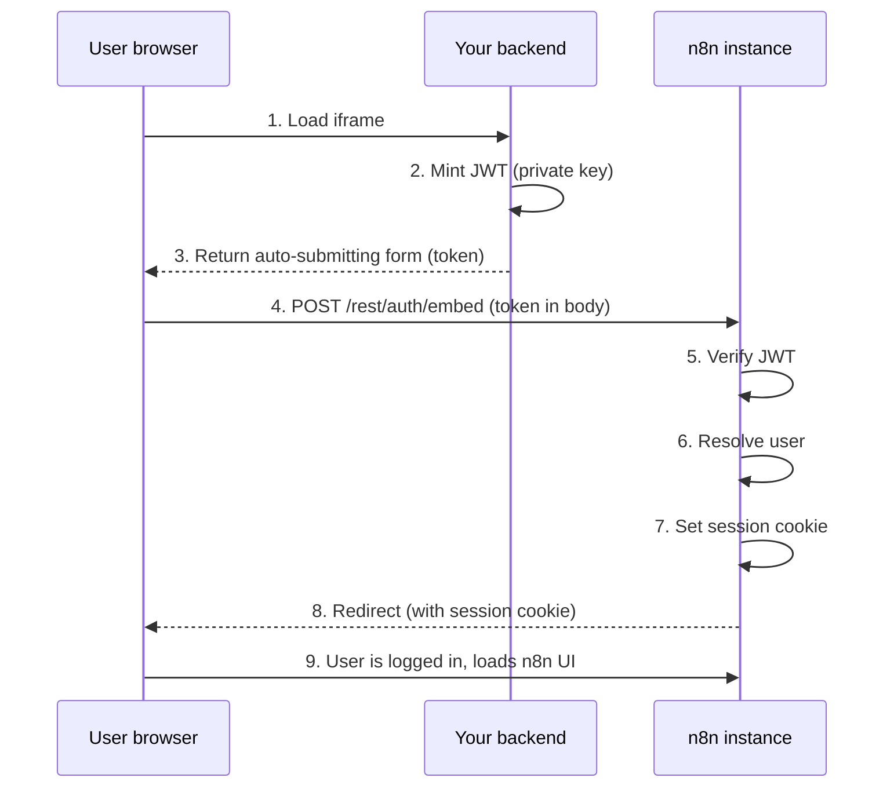
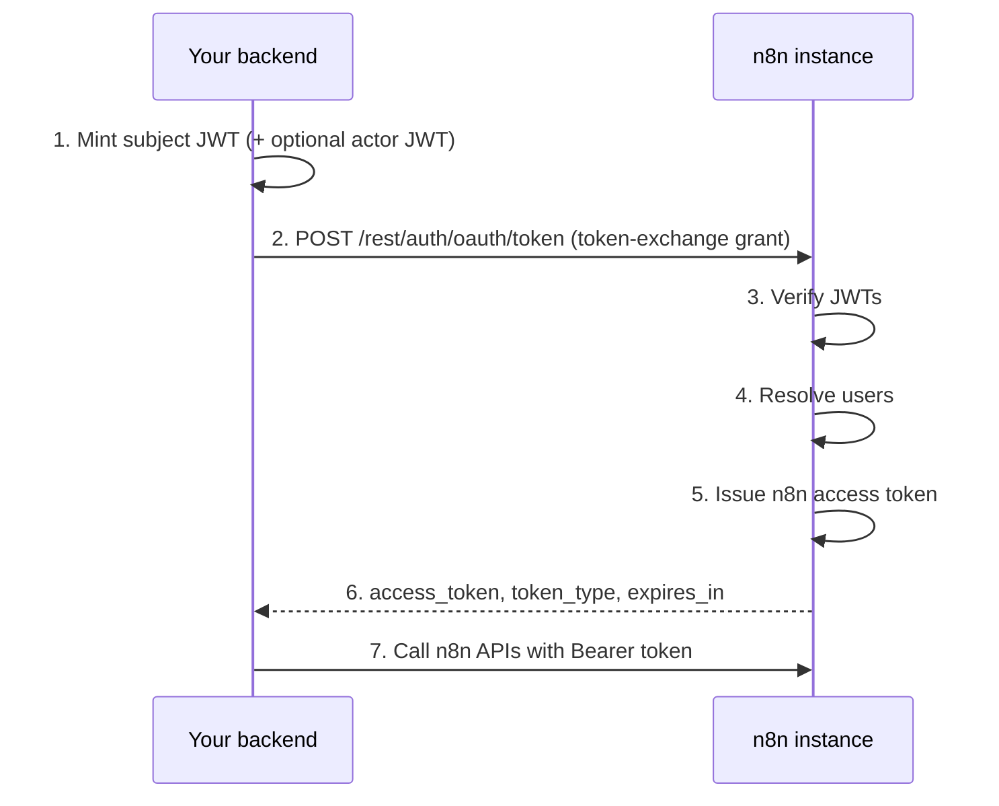

# 面向嵌入合作伙伴的令牌交换（Token exchange for embedding partners）


**功能可用性（Feature availability）**

* 仅在企业版（Enterprise）套餐中可用。
* 需要通过把 `N8N_ENV_FEAT_TOKEN_EXCHANGE` 环境变量设置为 `true` 来启用。自托管实例可以直接设置它。在 Cloud 上，请联系 n8n 支持团队申请。
* 面向运行外部身份提供方（IdP）或签发签名 JWT 的后端的嵌入合作伙伴。



**预览功能（Preview feature）**

令牌交换是一个位于环境变量标志（feature flag）后面的预览功能。在功能正式发布（general availability）之前，环境变量、端点路径和 JWT 声明（claim）约定都可能发生变化。请固定你的 n8n 版本，并在每次升级后重新测试你的集成。


OAuth 2.0 令牌交换（[RFC 8693](https://datatracker.ietf.org/doc/html/rfc8693)）允许嵌入合作伙伴在嵌入的 n8n 实例中认证用户，并代表用户执行操作。令牌交换支持两种使用场景：

* **iframe SSO（单点登录）**：用外部 JWT 换取 n8n 会话 cookie（session cookie），这样当你把 n8n 嵌入 iframe 时，用户就能无缝登录。
* **委派的 API 访问（Delegated API access）**：用外部 JWT 换取 n8n 访问令牌（access token），代表用户调用 n8n API，例如触发工作流或管理凭据。

两种流程的开头是一样的。你的后端用私钥签发一个短期有效的 JWT。n8n 用注册的公钥验证它，解析出用户，然后返回一个会话 cookie 或访问令牌。

## 开始之前（Before you begin）

你需要准备：

* 一份已启用令牌交换功能的企业版许可证。
* 在实例上设置预览功能标志：`N8N_ENV_FEAT_TOKEN_EXCHANGE=true`。
* 一个 RSA 或 EC 密钥对，或者你的 IdP 已经发布的 JWKS 端点。参见[生成密钥对](#generate-a-key-pair)。
* 通过 HTTPS 提供服务的 n8n 实例。浏览器会拒绝通过普通 HTTP 传输的 `SameSite=None; Secure` 会话 cookie，因此如果没有 HTTPS，iframe SSO 流程会静默失败。如果你在 TLS 终止代理后面运行 n8n，请确保代理设置了 `X-Forwarded-Proto` 请求头。

## 生成密钥对（Generate a key pair）

你需要一对非对称密钥。你的后端用**私钥**签发 JWT，n8n 用**公钥**验证它们。



```bash
# Generate a 2048-bit RSA private key
openssl genrsa -out private.pem 2048

# Extract the public key
openssl rsa -in private.pem -pubout -out public.pem
```



```bash
# Generate an EC private key using P-256
openssl ecparam -name prime256v1 -genkey -noout -out private.pem

# Extract the public key
openssl ec -in private.pem -pubout -out public.pem
```



把 `private.pem` 保密，保存在你的后端。把 `public.pem` 的内容注册到 n8n 的受信任密钥配置中。

如果你的 IdP 已经发布了 JWKS 端点（大多数 OAuth 2.0 和 OIDC 提供方都会），你可以跳过密钥生成，直接让 n8n 指向 JWKS URL。参见[JWKS 密钥来源](#jwks-key-source)。

## 环境变量（Environment variables）

### 所有配置都需要（Required for all setups）

```bash
# Enable the preview module
N8N_ENV_FEAT_TOKEN_EXCHANGE=true

# Register your public key(s) - see Configure trusted keys
N8N_TOKEN_EXCHANGE_TRUSTED_KEYS='[{ ... }]'
```

### 按流程开关（Per-flow toggles）

两个流程相互独立。只启用你使用的端点：

```bash
# Iframe SSO: enable the embed login endpoint (POST or GET /rest/auth/embed)
N8N_EMBED_LOGIN_ENABLED=true

# Delegated API access: enable the token exchange endpoint (POST /rest/auth/oauth/token)
N8N_TOKEN_EXCHANGE_ENABLED=true
```

嵌入登录端点不需要 `N8N_TOKEN_EXCHANGE_ENABLED`，令牌交换端点也不需要 `N8N_EMBED_LOGIN_ENABLED`。


**基于文件的配置（File-based configuration）**

你可以给单个变量加上 `_FILE` 后缀，把它的配置放在一个单独的文件里。更多细节请参阅[将敏感数据保存在单独的文件中（Keeping sensitive data in separate files）](https://app.gitbook.com/s/jm0ZYRpZIPWge2ZSiDYO/host-n8n/configure-n8n/basic-configuration#keeping-sensitive-data-in-separate-files)。


例如，对于较大或多行的 JSON，可以把受信任密钥存在一个文件里，然后设置 `N8N_TOKEN_EXCHANGE_TRUSTED_KEYS_FILE=/path/to/trusted-keys.json`。

### 可选调优设置（Optional tuning settings）

这些设置都有合理的默认值，通常不需要修改：

| 变量 | 默认值 | 说明 |
| :------- | :------ | :---------- |
| `N8N_TOKEN_EXCHANGE_MAX_TOKEN_TTL` | `900`（15 分钟） | 签发的 n8n 令牌的最大生命周期（秒）。实际过期时间是该值、主题令牌剩余生命周期和操作者令牌剩余生命周期（如果存在）这三者中的最小值。 |
| `N8N_TOKEN_EXCHANGE_KEY_REFRESH_INTERVAL_SECONDS` | `300`（5 分钟） | 当端点没有提供缓存生命周期时，刷新 JWKS 密钥的回退间隔。每个实例在启动时都会刷新密钥；在多主（multi-main）部署中，只有主（leader）实例会定期刷新。 |
| `N8N_TOKEN_EXCHANGE_JTI_CLEANUP_INTERVAL_SECONDS` | `60`（1 分钟） | n8n 清理过期的重放保护（replay-protection）记录的频率。 |
| `N8N_TOKEN_EXCHANGE_JTI_CLEANUP_BATCH_SIZE` | `1000` | 每次清理运行删除的最大过期记录数。 |
| `N8N_TOKEN_EXCHANGE_EMBED_LOGIN_PER_MINUTE` | `20` | 嵌入登录端点的速率限制（每个 IP 每分钟的请求数）。 |
| `N8N_TOKEN_EXCHANGE_TOKEN_EXCHANGE_PER_MINUTE` | `20` | 令牌交换端点的速率限制（每个 IP 每分钟的请求数）。 |

## 配置受信任密钥（Configure trusted keys）

`N8N_TOKEN_EXCHANGE_TRUSTED_KEYS` 环境变量接受一个 JSON 数组，内容是受信任的密钥来源。每个条目告诉 n8n 如何验证来自你的 IdP 的 JWT。

有两种来源类型：`static`（内联公钥）和 `jwks`（远程 JWKS 端点）。你可以在同一个数组中混用两种类型。

### 静态密钥来源（Static key source）

当你自己生成了密钥对、想直接嵌入公钥时，使用这种类型。

```json
{
	"type": "static",
	"kid": "my-key-1",
	"algorithms": ["RS256"],
	"key": "-----BEGIN PUBLIC KEY-----\nMIIBIjAN...contents-of-public.pem...\n-----END PUBLIC KEY-----",
	"issuer": "https://your-backend.example.com",
	"expectedAudience": "https://your-n8n.example.com",
	"allowedRoles": ["global:member"]
}
```

| 字段 | 必填 | 说明 |
| :---- | :------- | :---------- |
| `type` | 是 | 必须是 `"static"`。 |
| `kid` | 是 | 密钥 ID。必须与传入 JWT 的 `kid` 请求头一致。 |
| `algorithms` | 是 | 允许的签名算法数组，例如 `["RS256"]`。参见[受支持的算法](#supported-algorithms)。 |
| `key` | 是 | PEM 编码的公钥。JSON 中换行使用 `\n`。 |
| `issuer` | 是 | 传入 JWT 中预期的 `iss` 声明。 |
| `expectedAudience` | 否 | 如果设置，JWT 的 `aud` 声明必须匹配该值。如果未设置，n8n 完全跳过受众（audience）验证。生产环境中务必设置它，使用实例特定的值，例如你的 n8n 基础 URL。 |
| `allowedRoles` | 否 | 如果设置，只有这些角色可以通过 `role` 声明被分配。只有当你确实希望集成管理管理员用户时，才包含 `global:admin`。参见[角色处理](#role-handling)。 |

### JWKS 密钥来源（JWKS key source）

当你的 IdP 发布了 JWKS 端点时，使用这种类型。

```json
{
	"type": "jwks",
	"url": "https://idp.example.com/.well-known/jwks.json",
	"issuer": "https://idp.example.com",
	"expectedAudience": "https://your-n8n.example.com",
	"allowedRoles": ["global:member"]
}
```

| 字段 | 必填 | 说明 |
| :---- | :------- | :---------- |
| `type` | 是 | 必须是 `"jwks"`。 |
| `url` | 是 | JWKS 端点的 URL。 |
| `issuer` | 是 | 传入 JWT 中预期的 `iss` 声明。 |
| `expectedAudience` | 否 | 如果设置，JWT 的 `aud` 声明必须匹配该值。如果未设置，n8n 完全跳过受众验证。生产环境中务必设置它，使用实例特定的值，例如你的 n8n 基础 URL。 |
| `allowedRoles` | 否 | 如果设置，只有这些角色可以通过 `role` 声明被分配。参见[角色处理](#role-handling)。 |
| `cacheTtlSeconds` | 否 | 当 JWKS 端点没有发送 `Cache-Control: max-age` 请求头时的回退缓存时长。当请求头存在时，以请求头为准。默认 3600 秒。有效值被限制在 60 到 86400 秒之间。 |

### 完整示例（Full example）

```json
[
	{
		"type": "static",
		"kid": "my-static-key-1",
		"algorithms": ["RS256"],
		"key": "-----BEGIN PUBLIC KEY-----\nMIIBIjAN...your-key-here...\n-----END PUBLIC KEY-----",
		"issuer": "https://your-backend.example.com",
		"expectedAudience": "https://your-n8n.example.com",
		"allowedRoles": ["global:member"]
	},
	{
		"type": "jwks",
		"url": "https://idp.example.com/.well-known/jwks.json",
		"issuer": "https://idp.example.com",
		"expectedAudience": "https://your-n8n.example.com"
	}
]
```

### 受支持的算法（Supported algorithms）

n8n 只接受非对称算法。它排除了 HMAC 和 `none`。

| 家族 | 算法 |
| :----- | :--------- |
| RSA | `RS256`、`RS384`、`RS512` |
| RSA-PSS | `PS256`、`PS384`、`PS512` |
| 椭圆曲线（Elliptic Curve） | `ES256`、`ES384`、`ES512` |
| 爱德华兹曲线（Edwards Curve） | `EdDSA` |

对于静态密钥，配置中的算法必须全部属于同一家族，并且与密钥类型匹配。对于 JWKS 密钥，n8n 会根据 JWK 的 `alg` 和 `kty` 或 `crv` 字段自动推断算法。

## 必填和可选的 JWT 声明（Required and optional JWT claims）

### 必填声明（Required claims）

你的 IdP 令牌必须包含以下声明，n8n 才会接受它们：

| 声明 | 类型 | 说明 |
| :---- | :--- | :---------- |
| `sub` | string | 主体标识符（Subject identifier）。用户在 IdP 中的唯一 ID。 |
| `iss` | string（URL） | 签发者（Issuer）。必须与受信任密钥配置中的 `issuer` 一致。 |
| `aud` | string 或 string 数组 | 受众（Audience）。必须存在。只有当你为受信任密钥来源配置了 `expectedAudience` 时，n8n 才会校验该值。 |
| `iat` | number | 签发时间戳（Unix 纪元秒）。 |
| `exp` | number | 过期时间戳（Unix 纪元秒）。 |
| `jti` | string | 唯一令牌 ID。n8n 对每个值只接受一次（重放保护）。 |

### 可选声明（Optional claims）

| 声明 | 类型 | 说明 |
| :---- | :--- | :---------- |
| `email` | string（合法邮箱） | 用户的邮箱，用于匹配已有的 n8n 用户。即时（JIT）供应新用户时必需——即 n8n 还不认识的用户首次登录。除非你确定所有用户都已存在，否则始终发送它。 |
| `given_name` | string | 名（名字），会同步到 n8n 用户资料。 |
| `family_name` | string | 姓，会同步到 n8n 用户资料。 |
| `role` | string | 要分配的 n8n 角色，例如 `global:member` 或 `global:admin`。参见[用户供应](#user-provisioning)。 |
| `nbf` | number | 不早于（not-before）时间戳。 |

## iframe SSO 流程（Iframe SSO flow）

当你把 n8n 嵌入 iframe 时，使用这个流程。n8n 会用一个会话 cookie 让用户透明地登录。



### 第 1 步：在你的后端签发一个 JWT（Mint a JWT in your backend）

你的后端创建一个用你的私钥签名的短期有效 JWT。

```javascript
const fs = require('fs');
const jwt = require('jsonwebtoken');
const { randomUUID } = require('crypto');

const privateKey = fs.readFileSync('private.pem', 'utf8');
const now = Math.floor(Date.now() / 1000);

const token = jwt.sign(
	{
		sub: 'user-id-in-your-system',           // unique user identifier
		iss: 'https://your-backend.example.com', // must match trusted key config
		aud: 'https://your-n8n.example.com',     // must match expectedAudience (if set)
		iat: now,
		exp: now + 30,                           // short-lived: 30 seconds
		jti: randomUUID(),                       // unique per request
		email: 'user@example.com',               // required for first-time users
		given_name: 'Jane',                      // optional
		family_name: 'Doe',                      // optional
		role: 'global:member',                   // optional
	},
	privateKey,
	{ algorithm: 'RS256', header: { kid: 'my-key-1' } }
);
```


**最长 60 秒生命周期（Maximum 60-second lifetime）**

对于嵌入登录流程，JWT 的生命周期（`exp - iat`）不得超过 60 秒。n8n 会在服务端强制这一限制。


### 第 2 步：把令牌发送到嵌入端点（Send the token to the embed endpoint）

把令牌作为表单提交发送到 `POST /rest/auth/embed`。把 iframe 的 `src` 指向你后端的一个返回自动提交表单的页面：

```html
<form method="POST" action="https://your-n8n.example.com/rest/auth/embed">
	<input type="hidden" name="token" value="<jwt>">
	<input type="hidden" name="redirectTo" value="/workflow/abc123">
</form>
<script>document.forms[0].submit();</script>
```

可选的 `redirectTo` 字段只接受以 `/` 开头的相对路径。对于绝对 URL 或其他任何值，n8n 会回退到 `/`。

还有一个 `GET /rest/auth/embed?token=<jwt>&redirectTo=/workflow/abc123` 变体。建议优先使用 POST 表单：使用 GET 时，令牌会出现在服务器和代理日志、浏览器历史记录以及可能的 `Referer` 请求头中。如果必须使用 GET，请确保你的基础设施会从日志中擦除查询字符串。

### 第 3 步：n8n 验证并签发会话（n8n verifies and issues a session）

n8n 验证 JWT 签名，解析或供应用户（参见[用户供应](#user-provisioning)），设置一个安全会话 cookie（`SameSite=None; Secure`），然后重定向到指定路径。

### 第三方 cookie 限制（Third-party cookie restrictions）

当 n8n 运行在与你的产品不同的可注册域名上时，会话 cookie 就是第三方 cookie。浏览器的隐私功能（例如 Safari 的智能跟踪预防（Intelligent Tracking Prevention）和 Chrome 的第三方 cookie 限制）可能会阻止或分区（partition）它，从而破坏 iframe 登录。建议把 n8n 托管在你产品站点的子域名上，例如 `automation.your-product.example.com`，以避免这个问题。

## 委派的 API 访问流程（Delegated API access flow）

当你的后端需要代表用户调用 n8n API（例如以编程方式触发工作流或管理凭据）时，使用这个流程。

这个流程支持可选的**操作者令牌（actor token）**用于委派。操作者（actor）——例如服务账号或管理员——代表主体（subject）即最终用户执行操作。这样可以实现审计归属（audit attribution），n8n 会同时记录是谁执行了操作，以及是代表谁执行的。

当你提供操作者令牌时，n8n 会使用**操作者**的身份和权限来授权 API 调用。n8n 只记录主体用于审计归属，主体不会限制令牌可以做什么。这与 RFC 8693 不同——RFC 8693 中主体通常仍然是有效主体（effective principal）。请使用 n8n 角色只授予你的集成所需权限的操作者。



### 第 1 步：在你的后端签发 JWT（Mint JWTs in your backend）

创建一个代表最终用户的主题令牌。嵌入流程的 60 秒限制在这里不适用。签发的 n8n 访问令牌会在主题令牌的剩余生命周期、操作者令牌的剩余生命周期（如果存在）和 `N8N_TOKEN_EXCHANGE_MAX_TOKEN_TTL`（默认 15 分钟）这三者中的最小值之后过期。

```javascript
const now = Math.floor(Date.now() / 1000);

const subjectToken = jwt.sign(
	{
		sub: 'end-user-id',
		iss: 'https://your-backend.example.com',
		aud: 'https://your-n8n.example.com',
		iat: now,
		exp: now + 900,                         // bounds the issued token's lifetime
		jti: randomUUID(),
		email: 'user@example.com',
		role: 'global:member',
	},
	privateKey,
	{ algorithm: 'RS256', header: { kid: 'my-key-1' } }
);
```

对于委派，还要签一个代表执行操作的服务或管理员的操作者令牌。操作者的 n8n 角色决定了签发令牌的权限，所以请尽量保持低权限：

```javascript
const actorToken = jwt.sign(
	{
		sub: 'service-account-id',
		iss: 'https://your-backend.example.com',
		aud: 'https://your-n8n.example.com',
		iat: now,
		exp: now + 900,
		jti: randomUUID(),
		email: 'service@example.com',
	},
	privateKey,
	{ algorithm: 'RS256', header: { kid: 'my-key-1' } }
);
```

### 第 2 步：换取 n8n 访问令牌（Exchange for an n8n access token）

```bash
curl -X POST https://your-n8n.example.com/rest/auth/oauth/token \
	-H "Content-Type: application/x-www-form-urlencoded" \
	-d "grant_type=urn:ietf:params:oauth:grant-type:token-exchange" \
	-d "subject_token=<subject-jwt>" \
	-d "actor_token=<actor-jwt>"
```

请求字段（`application/x-www-form-urlencoded`）：

| 字段 | 必填 | 说明 |
| :---- | :------- | :---------- |
| `grant_type` | 是 | 必须是 `urn:ietf:params:oauth:grant-type:token-exchange`。 |
| `subject_token` | 是 | 代表最终用户的 JWT。 |
| `subject_token_type` | 否 | 令牌类型标识符。n8n 接受并忽略此字段。RFC 8693 要求它，所以如果你使用符合规范的客户端库，请发送 `urn:ietf:params:oauth:token-type:jwt`。 |
| `actor_token` | 否 | 代表操作者的 JWT（用于委派）。 |
| `actor_token_type` | 否 | 操作者令牌类型标识符。与 `subject_token_type` 一样，接受并忽略。 |
| `requested_token_type` | 否 | 请求的令牌类型标识符。接受并忽略。n8n 总是签发访问令牌。 |
| `scope` | 否 | 请求的作用域（最大 1024 字符）。会记录在签发的令牌和审计事件中，但不强制执行。 |
| `audience` | 否 | 预期的受众（最大 1024 字符）。接受并忽略。 |
| `resource` | 否 | 目标资源 URI，以空格分隔（最大 2048 字符）。会记录在签发的令牌和审计事件中，但不强制执行。 |


**作用域（scope）不强制执行**

签发的访问令牌携带执行用户的全部权限：发送操作者令牌时是操作者的权限，否则是主体的权限。n8n 只记录 `scope` 和 `resource` 用于审计，并不会把令牌限制在这些范围。要限制集成能做什么，请改用低权限的操作者和 `allowedRoles` 设置。


成功响应（`200 OK`）：

```json
{
	"access_token": "<n8n-jwt>",
	"token_type": "Bearer",
	"expires_in": 900,
	"issued_token_type": "urn:ietf:params:oauth:token-type:access_token"
}
```

### 第 3 步：使用访问令牌（Use the access token）

在后续的 n8n API 调用中带上令牌：

```bash
curl https://your-n8n.example.com/api/v1/workflows \
	-H "Authorization: Bearer <access-token>"
```

令牌在 `expires_in` 秒后过期。过期后请申请新的令牌。不要重复使用原来的外部 JWT，因为每个 `jti` 都是单次使用（single-use）的。

## 用户供应（User provisioning）

当你交换令牌时，n8n 按以下顺序把外部身份解析为 n8n 用户：

1. **已知身份（Known identity）**：n8n 在其身份存储中查找 `sub` 声明。如果之前的交换已经把这个 `sub` 关联到某个 n8n 用户，n8n 就返回该用户。
2. **邮箱回退（Email fallback）**：如果 `sub` 未知，但 JWT 包含 `email` 声明，n8n 会搜索使用该邮箱的现有用户。如果找到，n8n 从此把该外部身份关联到这个用户。
3. **即时供应（Just-in-time, JIT）**：如果两者都不匹配，n8n 会自动创建一个新用户。这要求 JWT 必须包含 `email` 声明。n8n 创建的新用户会禁用密码登录，因此他们只能通过令牌交换进行认证。

### 角色处理（Role handling）

如果你在令牌中包含 `role` 声明，你的 IdP 就成了该用户全局角色的权威来源：n8n 在每次交换时都会应用它，覆盖在 n8n 界面中分配的角色。除非你在 IdP 中管理角色，否则请省略该声明。

| 场景 | 行为 |
| :------- | :------- |
| 新用户，无 `role` 声明 | 分配 `global:member`。 |
| 新用户，有 `role` 声明 | 分配声明中的角色。如果角色无法识别、是 `global:owner`，或不在 `allowedRoles` 中，交换失败。 |
| 已有用户，无 `role` 声明 | 角色不变。 |
| 已有用户，有效的 `role` 声明 | 如果角色不同则更新。如果角色不在 `allowedRoles` 中，交换失败。 |
| 已有用户，无法识别或 `global:owner` 的角色声明 | 忽略该声明并发出服务端警告。登录继续，角色保持不变。 |
| 已有用户是 `global:owner` | 完全跳过角色同步。所有者角色不能通过令牌交换更改。 |

### 资料同步（Profile sync）

n8n 在每次登录时把 `given_name` 和 `family_name` 声明同步到用户资料。只有当值与已存储的不同时才会应用更改，并且会把超过 32 个字符的值截断。

## 安全注意事项（Security considerations）

### 短期有效令牌（Short-lived tokens）

* 嵌入流程的外部 JWT 生命周期最多 60 秒（`exp - iat <= 60`）。
* 对于令牌交换流程，签发的 n8n 令牌过期时间是主题令牌剩余生命周期、操作者令牌剩余生命周期（如果存在）和 `N8N_TOKEN_EXCHANGE_MAX_TOKEN_TTL`（默认 900 秒）中的最小值。
* 在令牌交换流程中，当计算出的签发令牌过期时间不足五秒时，n8n 会拒绝该请求。

### 重放保护（Replay protection）

每个外部 JWT 必须包含唯一的 `jti`（JWT ID）声明。n8n 会记录每个 `jti`，并拒绝任何 `jti` 已被使用过的令牌。n8n 会自动清理过期的 `jti` 记录。

### 仅限非对称签名（Asymmetric signatures only）

n8n 只接受非对称算法（RSA、EC、EdDSA）。它有意拒绝 HMAC 算法（例如 `HS256`）和 `none`。这确保了 n8n 永远不需要访问你的签名密钥。

### 受众限制（Audience restriction）

在每个受信任密钥来源上始终设置 `expectedAudience`。不设置的话，n8n 会跳过受众验证，那么来自已配置签发者的任何有效令牌都可以被交换——包括你的 IdP 为其他服务或其他 n8n 实例签发的令牌。请使用实例特定的值，例如你的 n8n 基础 URL。

### 角色约束（Role constraints）

受信任密钥来源上的 `allowedRoles` 字段限制了可以通过令牌交换分配的角色。用它可以实施最小权限原则（least privilege），例如限制某个嵌入集成只能供应 `global:member` 用户。OAuth 的 `scope` 和 `resource` 请求字段不会限制权限。参见[第 2 步：换取 n8n 访问令牌](#step-2-exchange-for-an-n8n-access-token)。

### 限制被嵌入（Restrict framing）

嵌入会话 cookie 使用 `SameSite=None`，因此浏览器会在任何第三方 iframe 上下文中发送它。请限制哪些网站可以嵌入（frame）你的 n8n 实例：配置你的反向代理发送 `Content-Security-Policy: frame-ancestors` 请求头，只列出你产品自身的来源。绝不要整体关闭嵌入保护。

### 密钥轮换与泄露（Key rotation and compromise）

要在不停机的情况下轮换密钥：向 `N8N_TOKEN_EXCHANGE_TRUSTED_KEYS` 添加一条带新 `kid` 的新条目，把后端切换到用新密钥签名，然后移除旧条目。如果私钥泄露，立即移除它的条目。这会阻止新的交换，但已经签发的 n8n 令牌和会话仍然有效，直到它们过期——受限于较短的令牌生命周期。

### 审计归属（Audit attribution）

n8n 会为所有令牌交换活动发出审计事件：

| 事件 | 触发时机 |
| :---- | :--- |
| `n8n.audit.token-exchange.succeeded` | 令牌交换成功。 |
| `n8n.audit.token-exchange.failed` | 令牌交换失败（含失败原因）。 |
| `n8n.audit.token-exchange.embed-login` | 嵌入登录成功。 |
| `n8n.audit.token-exchange.embed-login-failed` | 嵌入登录失败（含失败原因）。 |
| `n8n.audit.token-exchange.user-provisioned` | 通过 JIT 供应创建了新用户。 |
| `n8n.audit.token-exchange.identity-linked` | 已有用户关联到了新的外部身份。 |
| `n8n.audit.token-exchange.role-updated` | 通过令牌交换更改了用户角色。 |

当你使用操作者令牌流程时，n8n 会同时记录主体（代表谁）和操作者（谁执行的操作），从而在审计日志中实现完整的归属。

## 验证你的配置（Verify your setup）

签一个一次性 JWT 并交换它。把[第 1 步示例](#step-1-mint-a-jwt-in-your-backend)保存为 `mint-token.js`，在末尾加上 `console.log(token);`，然后运行：

```bash
node mint-token.js
```

然后调用令牌交换端点：

```bash
curl -X POST https://your-n8n.example.com/rest/auth/oauth/token \
	-H "Content-Type: application/x-www-form-urlencoded" \
	-d "grant_type=urn:ietf:params:oauth:grant-type:token-exchange" \
	-d "subject_token=<jwt>"
```

返回 `200` 并带有 `access_token`，就说明你的密钥、声明和配置都正常。对于嵌入流程，在浏览器中向 `POST /rest/auth/embed` 提交一个新令牌，应该能看到 n8n 界面加载。

## 故障排查（Troubleshooting）

| 症状 | 可能的原因 |
| :------ | :----------- |
| 两个端点都返回 `404` | 预览标志 `N8N_ENV_FEAT_TOKEN_EXCHANGE` 不是 `true`，或者你的许可证不包含令牌交换功能。n8n 根本不会加载该模块。 |
| `501 - Token exchange is not enabled on this instance` | `N8N_TOKEN_EXCHANGE_ENABLED` 不是 `true`。 |
| `501 - Embed login is not enabled on this instance` | `N8N_EMBED_LOGIN_ENABLED` 不是 `true`。 |
| `400 - unsupported_grant_type` | `grant_type` 字段缺失，或不完全是 `urn:ietf:params:oauth:grant-type:token-exchange`。 |
| `400 - invalid_grant`，描述为 `Token exchange failed` | 令牌交换端点上的任何令牌验证失败：签名无效、`kid` 未知、缺少 `kid` 请求头、`jti` 被重放、令牌过期或即将过期、受众不匹配，或角色不被允许。n8n 有意返回通用描述。请查看 n8n 服务器日志获取具体原因。 |
| `400 - invalid_request`，描述为 `Token claims validation failed` | 在令牌交换端点上：JWT 缺少必填声明（`sub`、`iss`、`aud`、`iat`、`exp`、`jti`），或者某个声明的类型错误。 |
| 嵌入端点返回 `401` | 响应包含具体的失败消息，例如 `Token has already been used`（`jti` 被重放）、`Token lifetime exceeds maximum allowed`（嵌入令牌必须满足 `exp - iat <= 60` 秒）、或 `Token header missing kid`。 |
| 嵌入端点返回 `500` | JWT 缺少必填声明，或某个声明的类型错误。 |
| iframe 中显示原始 JSON 错误 | 嵌入登录失败会返回 JSON 响应，不会重定向到错误页。把消息和上面的行对比一下。 |
| 嵌入登录后没有设置会话 cookie | 实例没有通过 HTTPS 提供服务，或者 TLS 终止代理没有转发 `X-Forwarded-Proto`。浏览器会拒绝通过普通 HTTP 传输的 `SameSite=None; Secure` cookie。第三方 cookie 限制也可能阻止该 cookie，参见[第三方 cookie 限制](#third-party-cookie-restrictions)。 |
| 首次登录没有创建用户 | JWT 缺少 `email` 声明，而它是 JIT 供应所必需的。 |
| 角色没有生效 | 对于已有用户，n8n 会忽略无法识别和 `global:owner` 的角色声明并发出服务端警告。有效但不在 `allowedRoles` 中的角色则会拒绝交换。参见[角色处理](#role-handling)。 |


**小白提示**：令牌交换（token exchange）解决的核心问题是"让用户用你家的账号体系登录 n8n，而不是再注册一套 n8n 账号"。你的后端签一个"通行证"（JWT）→ n8n 验证后发"入场券"（session cookie 或 access token）。记住三个最容易踩的坑：① 必须走 HTTPS；② 嵌入流程的 JWT 有效期不能超过 60 秒；③ 每个 JWT 必须带唯一 `jti`，用过即废。


## 相关资源（Related resources）

* [OEM 部署概述](./README.md)：把 n8n 的界面嵌入并展示在你的产品中。
* [配置 SSO（Set up SSO）](../configure-n8n/security/configure-sso.md)：通过 SAML 或 OIDC 实现组织级单点登录。
* [HTTP Request 凭据：使用 OAuth2](https://app.gitbook.com/s/BKcbOzIWja8NfqKDcqHc/builtin/credentials/httprequest#using-oauth2)：设置通用的 OAuth 2.0 凭据。
* [OAuth 2.0 令牌交换（RFC 8693）](https://datatracker.ietf.org/doc/html/rfc8693)：令牌交换规范。
